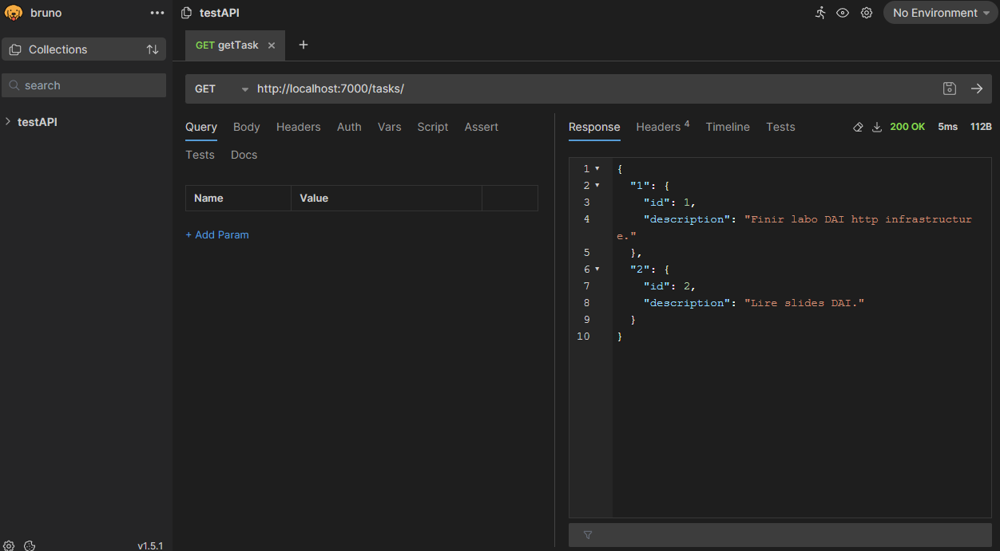
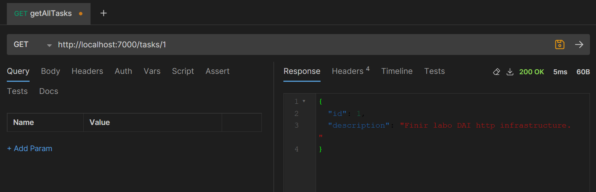
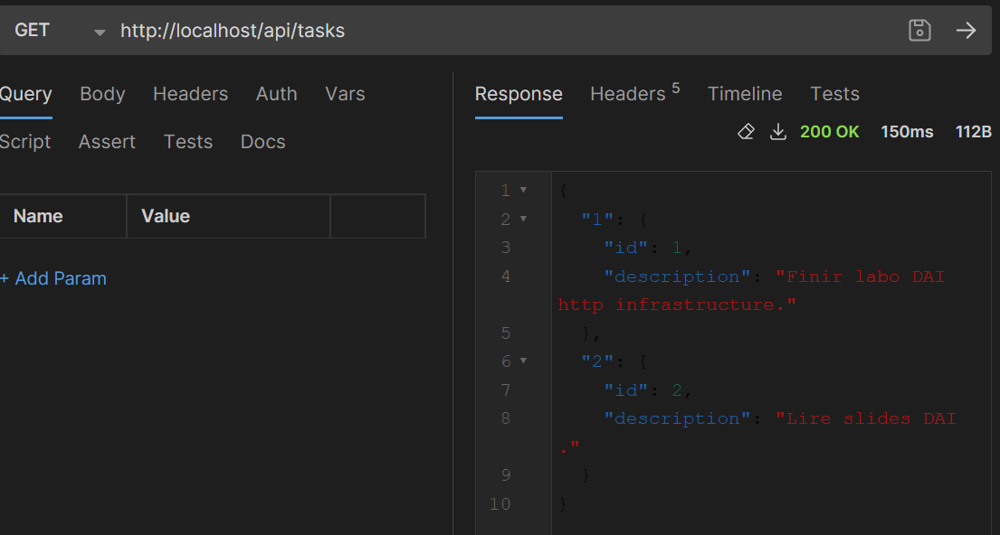
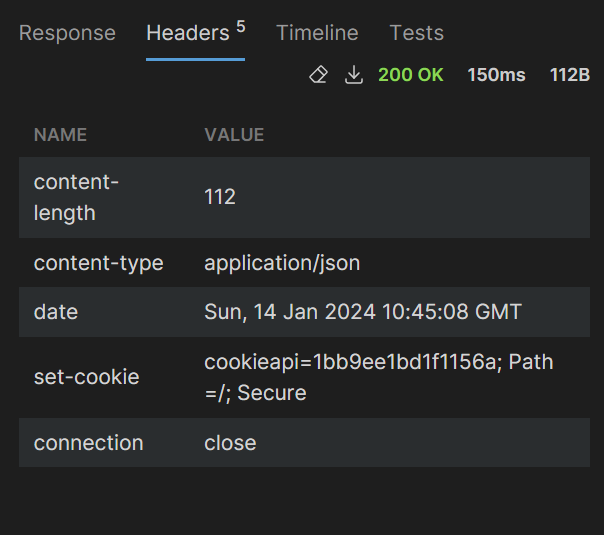
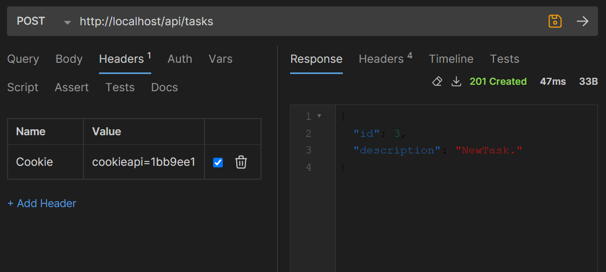
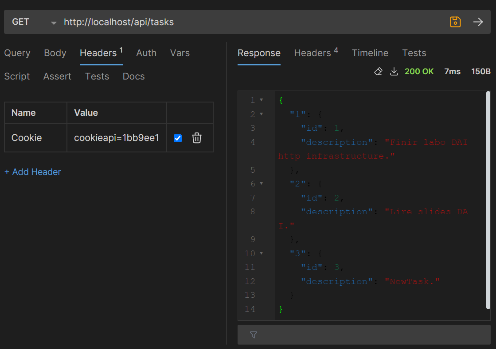
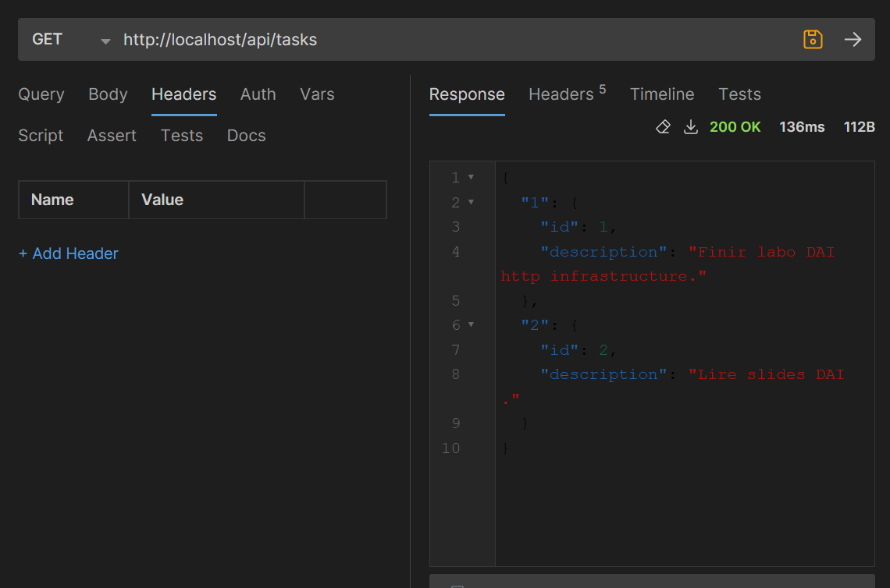

Lab 5 - HTTP infrastructure
=============================

## Step 0
- Github repository creation
- 'Rapport.md' file creation for project documentation

## Step 1: Static Web site
- Creation of 'web-static' folder
- Creation of 'web-static/static-html'
- Creation of a Dockerfile in 'web-static' folder.
  This docker file is based on the nginx image ('FROM nginx:latest'). It copies the static site content into the image ('COPY static-html /usr/share/nginx/html')

### Verification Steps
  - go to folder where Dockerfile is and run:
  
  ```bash
  docker build -t image-name . 
  ```
  
  (chez moi le nom de l'image est 'static-web-server' mais on peut choisir n'importe lequel)

  - check if it's built with following command and image should be listed.
  
  ```bash 
  docker images 
  ```
- Creation of 'nginx.conf' file and configuration
  This file is the main configuration for Nginx web server.
  (For information: it contains directives that define how Nginx should function, what content it should serve and how it should handle various aspects of web requests)

  It is composed of configuration blocks. In our case, we need a 'http' block which will contain server configuration and a one 'server' block inside it that will specify how Nginx handles requests for static content of our website.

  'access_log' and 'error_log' are not mandatory but it is better to set it up for troubleshooting.

  'sendfile' and 'keepalive_timeout' not mandatory but enhances performance as it facilitates data transfering and sets how long server should wait before closing a connection.

    ```bash
  #http block  
  http { 
    #Specifies where Nginx should log access and error information. 
    access_log /var/log/nginx/access.log ;
    error_log /var/log/nginx/error.log;
      
        sendfile on;
        keepalive_timeout 65;
      
        server {
            #Specifies in which port the server will be listening for connections to serve the content
            listen 80; 
            server_name localhost;
      
            #Specifies how to handle connections according to path. 
            #Here path is '/', the root of our website.  
            location / {
                #Specifies root directory for files to serve when a request is made to the specified path. 
                root /usr/share/nginx/html;
                #Specifies the default file to serve when the client requests a directory without specifying a particular file.
                index index.html;
            }
        }
    }
  ```

### Verification Steps
  
  Run image
  
  ```bash 
  docker run -p 8080:80 static-web-server 
  ```
  
  Access the static content from a browser by opening a browser and going to the path below and you should be able to see the web site. 
  
  ```bash
  http://localhost:8080/ 
  ```

## Step 2: Docker Compose
- Creation of 'docker.compose.yml' file in 'web-static' folder
  It specifies which docker compose version we use, section 'service' defines a service name 'web' that uses directory specified in 'build' (here '.' so current directory) as the build context for our image. 
  
  It specifies the port of the host machine '8080' and the container port '80'. So when we access 'localhost:8080' in the host machine, it will be forwarded to port 80 in the container. 

### Verification Steps
 Start infrastructure by running:
  ```bash
  docker compose up -d
  ```
  Access the web server by opening a browser and going to 
  ```bash 
    localhost:8080
  ```
  Stop infrastructure by running:
  ```bash
  docker compose down
  ```
  Rebuild docker image with:
  ```bash
  docker compose build
  ```
  and try starting the image and accessing the website again to check that it works.

## Step 3: HTTP API server

- Setting up Javalin with Maven
  Add Javalin dependency to pom.xml in 'dependency' block then clean and build it again with to make sure it's working.
  ``bash
  mvn clean package
  ``
- Define Javalin server main class that starts the Javalin server and defines the routes. 
- Define classes and controller according to API. 
  
  //TODO MODIFIER SELON CHANGEMENTS
  In our case, we have chosen to create a simple API to manage a list of tasks. Each task has an id and a description. In order to implement it, we have created a Task class and a TaskApi class that acts as a controller and handle requests. 
  The TaskApi class has a list that tracks existing tasks as well as the id number of the next task. 
  In order to support CRUD operations, we have defined the following routes in the main Class as well as the necessary methods in the TaskApi class.

  ```java
  // Create
  app.post("/tasks", TaskApi::createTask);
  //Read
  app.get("/tasks", TaskApi::getAllTasks);
  app.get("/tasks/{taskId}", TaskApi::getTaskById);
  //Update
  app.put("/tasks/{taskId}", TaskApi::updateTask);
  //Delete
  app.delete("/tasks/{taskId}", TaskApi::deleteTask);
  ```





## Step 4 Reverse proxy with Traefik

To enhance the security and scalability of our infrastructure, we introduced a reverse proxy using Traefik. This component acts as an intermediary between client requests and backend servers, dynamically adjusting to the number of running servers. The Traefik image was added as a new service named 'reverse-proxy' in our Docker Compose file.

### Configuration Details
1. Traefik Configuration:
We configured Traefik by introducing a new service named 'reverse-proxy,' utilizing the Traefik image.
Within this service, we explicitly specified :
  - `'image'` : the Docker image and version to be used for the Traefik service.
  - `'command'` : command-line arguments that Traefik should use when starting. In our case:
    - `--api.insecure=true` : enables Traefik dashboard
    - `--providers.docker` :  instructs Traefik to dynamically discovers and routes to Docker containers.
- `'volumes'` : instructs Traefik to listen to Docker events through the `/var/run/docker.sock` file, allowing it to dynamically adjust to changes in the backend server configuration.
- `'ports'` : Specifies the port mappings between the host machine and the Traefik container. In our case:
  - `"80:80"` : Maps port 80 on the host to port 80 on the Traefik container, enabling routing of web static and API requests.
  - `"8080:8080"` : Maps port 8080 on the host to port 8080 on the Traefik container, providing access to the Traefik dashboard.

1. Routing Configuration:
We specified routing rules for Traefik using labels. Requests with the 'Host' header set to 'localhost' are directed to the 'web' service, while those with a 'Host' header of 'localhost' and a path prefix of '/api' are routed to the 'api' service.

1. Code Modifications:
Route definitions for CRUD operations in the code were adjusted to match the new routing configuration. For example, the route for creating tasks was changed from `app.post("/tasks", ...)` to `app.post("/api/tasks", ...)`.

### Verification Steps

1. Restarting Services
After modifying your Docker Compose file, restart services by executing:
```bash
docker-compose down
docker-compose up -d
```

1. Consulting the Traefik Dashboard 
The Traefik dashboard are accessible at http://localhost:8080/dashboard/#/ to verify the routing configuration. 

1. Testing with a Browser
The static web service is accessible at http://localhost/80 .
The api service is accessible at http://localhost/api .

## Step 5 Scalability and load balancing

### Configuration details 

To statically modify the number of instances of web services that are started, we need to modify our docker-compose.yml. 
This way Traefik will be able to automatically discover services using labels. To add duplicated instances, we must add:
 ```bash
deploy:
    replicas: x
 ```
Where x is the number of wanted instances. 

- labels:
  - "traefik.enable=true"  : for each service
  - - "traefik.http.services.static.loadbalancer.server.port=x"   x = 80 for web, x = 7000 for api

1. Dynamically Update Instances

To start multiple instances of each service (web and api)  without having to stop and restart the topology, and allow Traefik to detect them and distribute connections among them, we can use the "scaling" feature of Docker Compose.

 ```bash
docker-compose up --scale web=<n> --scale api=<m> -d
 ```

You should see n containers for web service and m containers for api services being started (as well as one traefik container). Here's an exemple for n = 4 and m = 4.

 ```bash
> docker-compose up --scale web=4 --scale api=4 -d
[+] Building 0.0s (0/0)                                                                                                                                                                                              docker:default
[+] Running 9/9
 ✔ Container web-static-traefik-1  Started                                                                                                                                                                                     0.0s 
 ✔ Container web-static-api-4      Started                                                                                                                                                                                     0.0s 
 ✔ Container web-static-api-2      Started                                                                                                                                                                                     0.0s 
 ✔ Container web-static-web-3      Started                                                                                                                                                                                     0.0s 
 ✔ Container web-static-api-5      Started                                                                                                                                                                                     0.0s 
 ✔ Container web-static-web-1      Started                                                                                                                                                                                     0.0s 
 ✔ Container web-static-api-3      Started                                                                                                                                                                                     0.0s 
 ✔ Container web-static-web-2      Started                                                                                                                                                                                     0.0s 
 ✔ Container web-static-web-4      Started                                                                                                                                                                                     0.1s 
 ```
 
If we wish to modify the number of instances without having to stop and restart the topology, rerun the last command with the new information.

If you want less instances than the number of instances currently running, use the same commands to specify the number of instances wanted and it will down scale the infrastructure.

### Verification steps
1. Number of instances
Other than docker response when dynamically updating the number of instances, you can also verify it through traefik dashboard. It provides real-time information about the backend services and their instances. 

Access `http://localhost:8080/dashboard/#/http/services` and verify that the number of servers next to `api@docker` correspond to number of api servers instances started and same for web servers on `static@docker`.  

1. Check that the reverse proxy distributes the connections between the different instances.
 To verify this, we used the following commands that displays the logs for the web/api service in a Docker Compose environment.
```bash
docker-compose logs -f web
docker-compose logs -f api
```

We then accessed `localhost/80` multiple times and verified the logs in the terminal. It showed that for each request on our web service, traefik asked different containers. 

We also verified this using bruno. We created a new task (this should create a new task in one of the containers). We then asked to get/delete the recently created task. Sometimes it would work, sometimes it would return "task not found". This was the expected results and verified traefik was indeed distributing the connections between the different instances. 


## Step 6 Load balancing with round-robin and sticky sessions
To configure Traefik so that it uses persistent sessions for the instances of our dynamic server (API service), we need to use sticky sessions in our docker-compose.yml file.
 ```bash

- "traefik.http.services.api.loadbalancer.sticky.cookie=true"
- "traefik.http.services.api.loadbalancer.sticky.cookie.name=cookieapi"
- "traefik.http.services.api.loadbalancer.sticky.cookie.secure=true"
 ```
The first line enables the sticky sessions, the second line allows specifying a name for it, and the last line is for securing it.

For static services, no change is necessary since the default behavior of Traefik is to use round-robin.

### Verification steps
1. Round-robin for static servers
While deploying multiple instances of the web server, 
//TODO 

2. Sticky sessions for dynamic servers

We verified this using bruno. We sent a first get request from which we got a cookie id:


Using this id, we sent a post request to create a new Task:

We then requested all tasks again and the recently added task was indeed in the response:


We also requested all tasks using a different cookie id and task 3 was not in the response.



## Step 7 Securing Traefik with HTTPS


## Optional Steps
### Optional Step 1 : Management UI

### Optional Step 2 : Integration API - static Web site