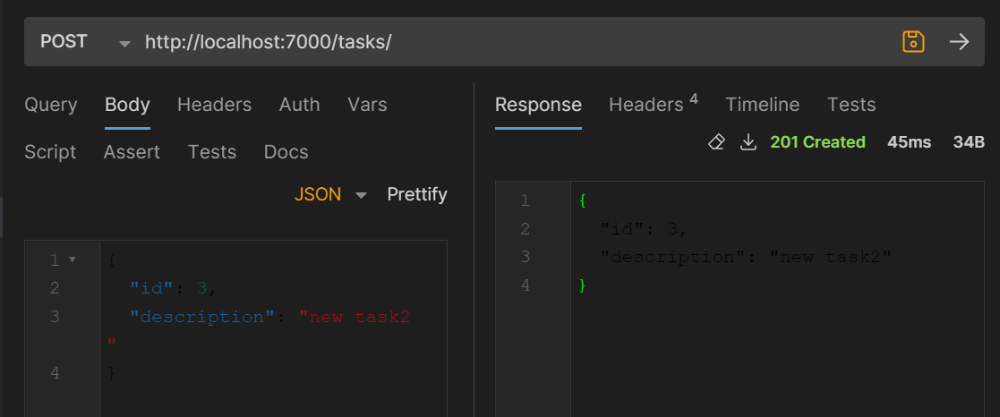
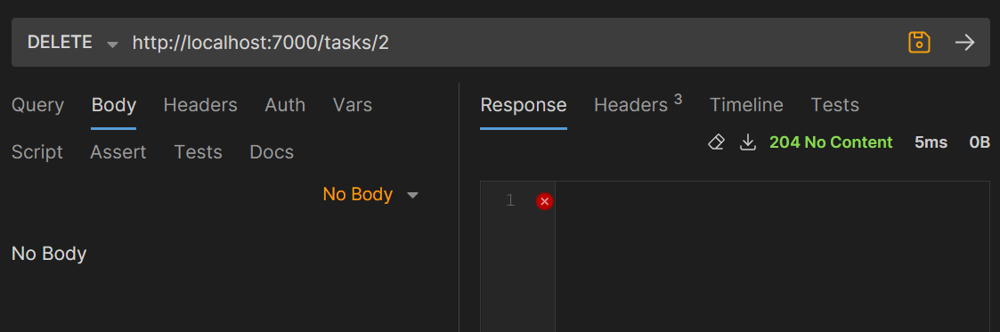
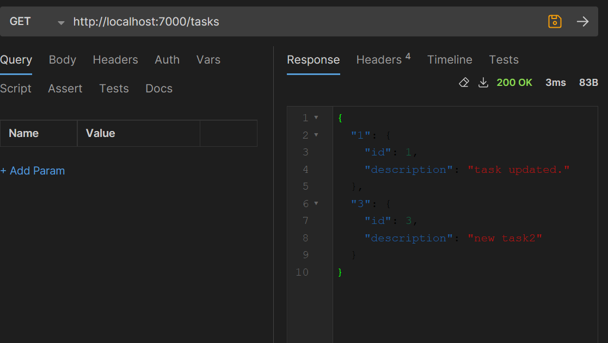

Lab 5 - HTTP infrastructure
=============================

## Step 0
- Github repository creation
- 'Rapport.md' file creation for project documentation

## Step 1: Static Web site
- Creation of 'web-static' folder
- Creation of 'web-static/static-html'
- Creation of a Dockerfile in 'web-static' folder.
  This docker file is based on the nginx image ('FROM nginx:latest'). It copies the static site content into the image ('COPY static-html /usr/share/nginx/html')
  
  Verification:
  - go to folder where Dockerfile is and run:
  
  ```bash
  docker build -t image-name . 
  ```
  
  (chez moi le nom de l'image est 'static-web-server' mais on peut choisir n'importe lequel)

  - check if it's built with following command and image should be listed.
  
  ```bash 
  docker images 
  ```
- Creation of 'nginx.conf' file and configuration
  This file is the main configuration for Nginx web server.
  (For information: it contains directives that define how Nginx should function, what content it should serve and how it should handle various aspects of web requests)

  It is composed of configuration blocks. In our case, we need a 'http' block which will contain server configuration and a one 'server' block inside it that will specify how Nginx handles requests for static content of our website.

  'access_log' and 'error_log' are not mandatory but it is better to set it up for troubleshooting.

  'sendfile' and 'keepalive_timeout' not mandatory but enhances performance as it facilitates data transfering and sets how long server should wait before closing a connection.

    ```bash
  #http block  
  http { 
    #Specifies where Nginx should log access and error information. 
    access_log /var/log/nginx/access.log ;
    error_log /var/log/nginx/error.log;
      
        sendfile on;
        keepalive_timeout 65;
      
        server {
            #Specifies in which port the server will be listening for connections to serve the content
            listen 80; 
            server_name localhost;
      
            #Specifies how to handle connections according to path. 
            #Here path is '/', the root of our website.  
            location / {
                #Specifies root directory for files to serve when a request is made to the specified path. 
                root /usr/share/nginx/html;
                #Specifies the default file to serve when the client requests a directory without specifying a particular file.
                index index.html;
            }
        }
    }
  ```

  Verification:
  
  Run image
  
  ```bash 
  docker run -p 8080:80 static-web-server 
  ```
  
  Access the static content from a browser by opening a browser and going to the path below and you should be able to see the web site. 
  
  ```bash
  http://localhost:8080/ 
  ```

## Step 2: Docker Compose
- Creation of 'docker.compose.yml' file in 'web-static' folder
  It specifies which docker compose version we use, section 'service' defines a service name 'web' that uses directory specified in 'build' (here '.' so current directory) as the build context for our image. 
  
  It specifies the port of the host machine '8080' and the container port '80'. So when we access 'localhost:8080' in the host machine, it will be forwarded to port 80 in the container. 
  
  Verification:
  Start infrastructure by running:
  ```bash
  docker compose up -d
  ```
  Access the web server by opening a browser and going to 
  ```bash 
    localhost:8080
  ```
  Stop infrastructure by running:
  ```bash
  docker compose down
  ```
  Rebuild docker image with:
  ```bash
  docker compose build
  ```
  and try starting the image and accessing the website again to check that it works.

## Step 3: HTTP API server

- Setting up Javalin with Maven
  Add Javalin dependency to pom.xml in 'dependency' block then clean and build it again with to make sure it's working.
  ``bash
  mvn clean package
  ``
- Define Javalin server main class that starts the Javalin server and defines the routes. 
- Define classes and controller according to API. 
  
  //TODO MODIFIER SELON CHANGEMENTS
  In our case, we have chosen to create a simple API to manage a list of tasks. Each task has an id and a description. In order to implement it, we have created a Task class and a TaskApi class that acts as a controller and handle requests. 
  The TaskApi class has a list that tracks existing tasks as well as the id number of the next task. 
  In order to support CRUD operations, we have defined the following routes in the main Class as well as the necessary methods in the TaskApi class.

  ```java
  // Create
  app.post("/tasks", TaskApi::createTask);
  //Read
  app.get("/tasks", TaskApi::getAllTasks);
  app.get("/tasks/{taskId}", TaskApi::getTaskById);
  //Update
  app.put("/tasks/{taskId}", TaskApi::updateTask);
  //Delete
  app.delete("/tasks/{taskId}", TaskApi::deleteTask);
  ```






## Step 4 Reverse proxy with Traefik

To establish a reverse proxy, we introduce a new service named 'reverse-proxy,' utilizing the Traefik image. Within this service, we explicitly define the HTTP port and the API port. Additionally, in the 'volumes' section, we specify that Traefik should actively monitor Docker events, aligning with the guidance outlined in the Traefik Quick Start guide.
We also added 'labels' instruction to specify how traefik should route incoming requests for each service.
1. Requests with the 'Host' header set to 'localhost' will be directed to the 'web' service.
1. Requests with the 'Host' header set to 'localhost' and a path prefix of '/api' should be routed to the 'api' service.

We then changed the routes to which execute each CRUD operation as the exemple below to match route for the api service.
```java
app.post("/tasks", TaskApi::createTask);
```
to
```java
app.post("/api/tasks", TaskApi::createTask);
```

Verification:

Restarting Services:
After modifying your docker-compose.yml file, we restart our services by executing:
```bash
docker-compose down
docker-compose up -d
```
Consulting the Traefik Dashboard:
Open your browser and go to the address where the Traefik dashboard is accessible. There, you will find our router for the web service.
``bash
http://localhost:8080/dashboard/#/
``

Testing with a Browser:
Simply open your browser to access http://localhost, which should yield a response from the static web service.
For the static website:
`` bash
http://localhost/80
``
For the API:
``bash
http://localhost/api
``

## Step 5 Scalability and load balancing

# Scalability
Initially, we need to modify our docker-compose.yml to enable Traefik to automatically discover services using labels. To add duplicated instances, we must add:
 ```bash
deploy:
    replicas: 5
 ```

To start multiple instances of each service (web and api) and allow Traefik to detect them and distribute connections among them, we can use the "scaling" feature of Docker Compose.

 ```bash
docker-compose up --scale web=<count> --scale api=<count> -d
 ```
 ```bash
> docker-compose up --scale web=4 --scale api=4 -d
[+] Building 0.0s (0/0)                                                                                                                                                                                              docker:default
[+] Running 9/9
 ✔ Container web-static-traefik-1  Started                                                                                                                                                                                     0.0s 
 ✔ Container web-static-api-4      Started                                                                                                                                                                                     0.0s 
 ✔ Container web-static-api-2      Started                                                                                                                                                                                     0.0s 
 ✔ Container web-static-web-3      Started                                                                                                                                                                                     0.0s 
 ✔ Container web-static-api-5      Started                                                                                                                                                                                     0.0s 
 ✔ Container web-static-web-1      Started                                                                                                                                                                                     0.0s 
 ✔ Container web-static-api-3      Started                                                                                                                                                                                     0.0s 
 ✔ Container web-static-web-2      Started                                                                                                                                                                                     0.0s 
 ✔ Container web-static-web-4      Started                                                                                                                                                                                     0.1s 
 ```
We can see that 4 instances have launched.

# Load balancing

## Step 6 Load balancing with round-robin and sticky sessions


## Step 7 Securing Traefik with HTTPS


## Optional Steps
# Optional Step 1 : Management UI

# Optional Step 2 : Integration API - static Web site